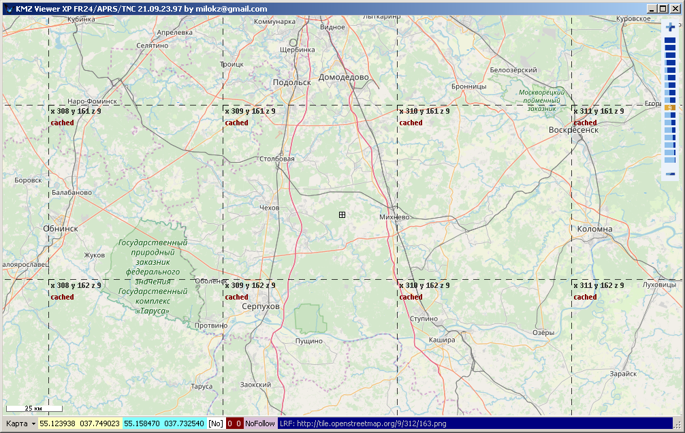
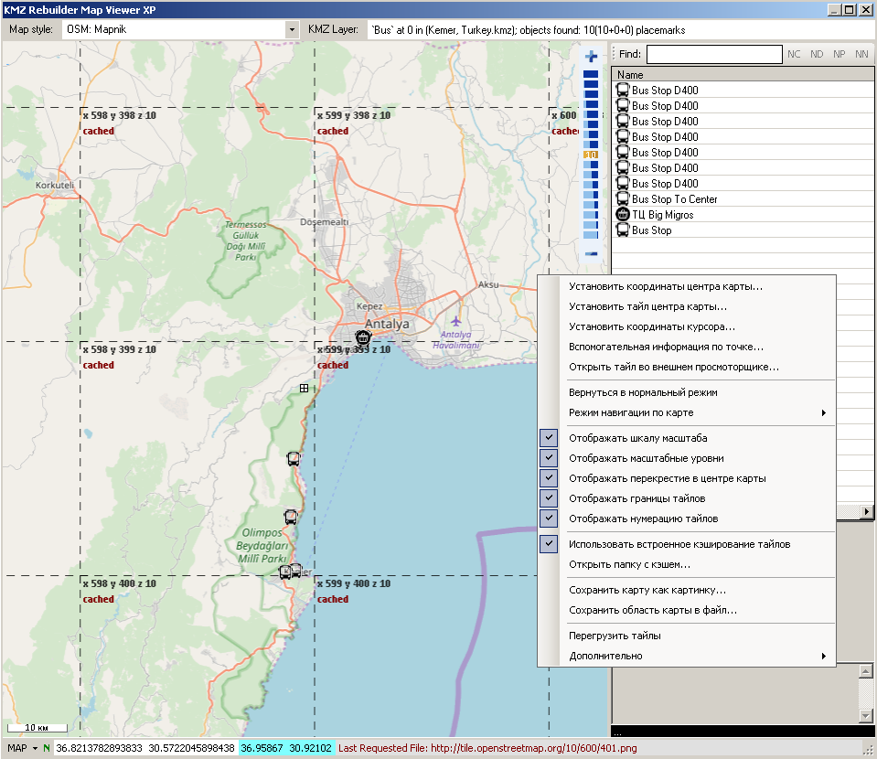

# NaviMapNet
C# class library for map tiles such as Google, OSM, Bing, Yahoo
to use in application forms
support overlay: points, lines, polygons

Projects with NaviMapNet: [KMZViewer](https://github.com/dkxce/KMZViewer), [KMZRebuilder](https://github.com/dkxce/KMZRebuilder), [MapnikTileRenderer](https://github.com/dkxce/MapnikTileRenderer), [PolygonCreator](https://github.com/dkxce/PolygonCreator), [InterpolateTrack2LessPoints](https://github.com/dkxce/InterpolateTrack2LessPoints), [APRSWin](https://github.com/dkxce/APRSWin) and others...

